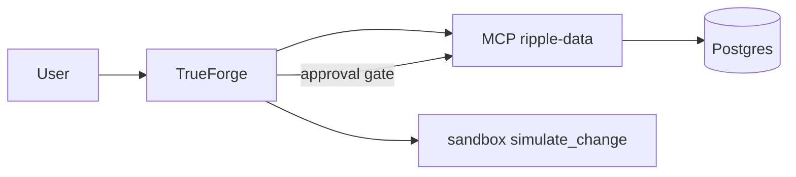

# Ripple

Ripple is a TrueForge-powered change-impact analysis agent for supply-chain and operations teams. Before you replace a SKU, swap a supplier part, or change pricing, Ripple queries operational data (orders, shipments, purchase orders, pricing rules), simulates the downstream blast radius in a sandbox, and only applies safe database updates after explicit human approval.

Built for the [Agent Harness Hackathon](https://www.wemakedevs.org/hackathons/trueforge) on TrueForge.

Product specification: [docs/design/](docs/design/README.md)

## Prerequisites

- **Node.js** 22.14+
- **Docker** and **Docker Compose** (local Postgres)
- **npm** 9+
- **Fireworks** or **Google Gemini** API key (configured in TrueForge UI)

You do **not** need to clone [TrueForge](https://github.com/truefoundry/trueforge). Run it via `npx`.

## Quick start (demo)

```bash
npm install
npm run demo:prep              # reset DB to Scenario A seed
npm run trueforge              # terminal 1 → http://localhost:8790
npm run mcp:dev                # terminal 2
npm run mcp:register           # once, TrueForge must be running
npm run agent:update           # Fireworks + sandbox + approval gate
```

Open **Agents → ripple** and ask:

```
What is the impact of changing SKU ACME-1847 to ACME-2847?
```

Then: *"Approve safe updates"* → click **Allow** on `apply_product_update`.

**Full 3-minute demo script:** [docs/DEMO.md](docs/DEMO.md)

### Expected results (Scenario A)

| Check | Value |
|-------|-------|
| Revenue at risk | **21850** |
| Purchase orders | **101**, **102** |
| Customer orders (manual) | **9001**, **9002** |
| In-transit shipment flagged | **5002** |
| SKU after approval | **ACME-2847** |

Default agent model: `fireworks/minimax-m3`. Gemini alternative: set `RIPPLE_MODEL=google-gemini/gemini-3-6-flash` before `agent:create`.

Reset demo: `npm run db:reset`

## Verification

```bash
npm run ci                     # build + simulation tests locally
npm run verify:phase6          # full pre-submit gate (includes Docker integration)
```

Per-phase gates: `verify:phase0`, `verify:phase3`, `verify:phase5`

## Why TrueForge

Ripple is not a thin LLM wrapper. TrueForge runs the full agent loop:



| Harness feature | How Ripple uses it |
|-----------------|-------------------|
| **MCP tools** | Live queries + audited writes to Postgres |
| **Sandbox** | `simulate_change.py` — revenue/counts are code, not guesses |
| **Approval gate** | `apply_product_update` blocked until user clicks Allow |
| **Skills** | `ripple-simulation` skill from public GitHub |

## Repository layout

| Path | Purpose |
|------|---------|
| `db/` | Postgres schema, seed, migrations, Docker Compose |
| `mcp-server/` | MCP read/write tools over Streamable HTTP |
| `simulation/` | Deterministic `simulate_change.py` |
| `agent/` | TrueForge instructions + `ripple-simulation` skill |
| `scripts/` | Setup, demo prep, verification |
| `docs/DEMO.md` | Judge-ready demo script |
| `docs/VIDEO.md` | Demo video shot list |
| `docs/PORTAL_SUBMIT.md` | Hackathon portal submission |

## Rehearsal

```bash
npm run rehearsal:verify   # automated MCP + simulation + DB checks
```

Manual chat (run **twice** before recording): see [docs/DEMO.md](docs/DEMO.md). Video checklist: [docs/VIDEO.md](docs/VIDEO.md).

## Phase roadmap

| Phase | Focus | Status |
|-------|--------|--------|
| 0–2 | Foundation, DB, MCP reads | Done |
| 3 | Sandbox simulation | Done |
| 4 | Agent orchestration | Partial (no subagents) |
| 5 | Approval + safe mutations | Done |
| 6 | Demo polish + submission | Done |

## Environment variables

See [.env.example](.env.example). Copy to `.env` locally; never commit `.env`.

## Qodo Code Review Evidence

Per [hackathon rules](https://www.wemakedevs.org/hackathons/trueforge/rules). Install the [Qodo GitHub App](https://www.qodo.ai/) on this repo.

- **Phase 6 PR:** https://github.com/maannaan/Ripple/pull/1 — initial submission merge
- **Qodo review PR:** https://github.com/maannaan/Ripple/pull/2 _(submission docs + README for TrueForge judges — update findings after Qodo review)_
- **Findings:** _(Update after PR #2 Qodo review: what was flagged and fixed/dismissed)_
- **Trail:** PR #2 should show Qodo review, responses, and follow-up on final code. Comment `/agentic_review` if review does not start.

## Hackathon submission checklist

- [x] README with setup and demo steps
- [x] CI passing (`npm run ci` + [GitHub Actions](https://github.com/maannaan/Ripple/actions))
- [x] Working E2E demo (fetch → simulate → approve → execute)
- [x] Public GitHub repository — https://github.com/maannaan/Ripple
- [ ] Demo video (~3 minutes) — [docs/VIDEO.md](docs/VIDEO.md) _(add URL here after upload)_
- [ ] Qodo merged PR #2 linked with findings summary above
- [ ] Submit on [WeMakeDevs portal](https://www.wemakedevs.org/hackathons/trueforge) — [docs/PORTAL_SUBMIT.md](docs/PORTAL_SUBMIT.md)
- [ ] Blog post (optional prize track)

## License

MIT — see [LICENSE](LICENSE).

Legacy Phase 0 notes: [docs/LEGACY.md](docs/LEGACY.md)
