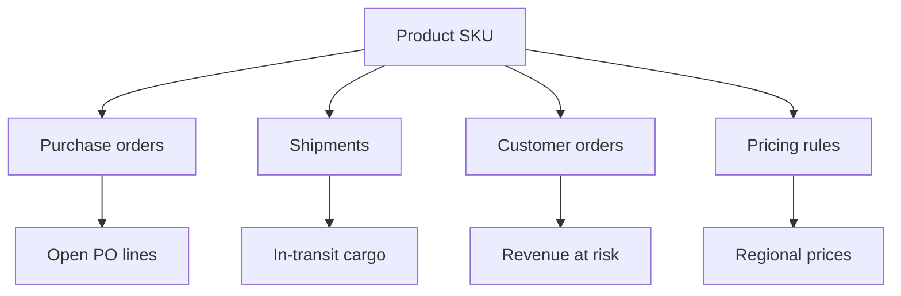
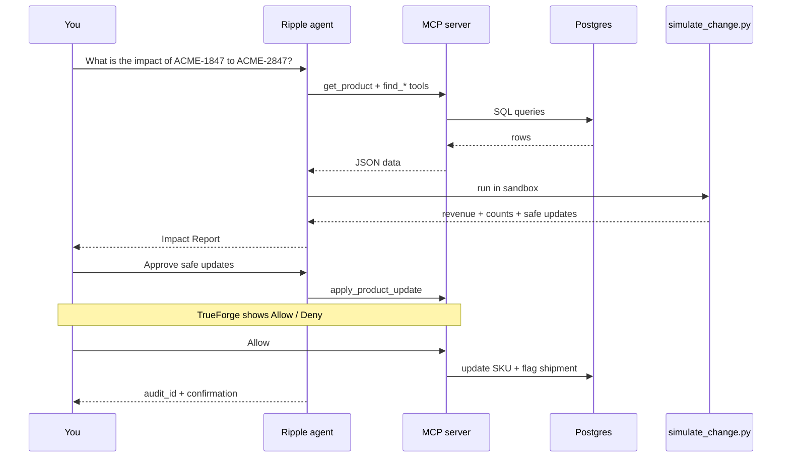
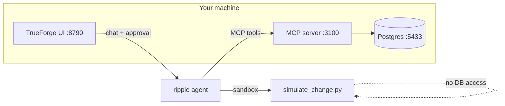
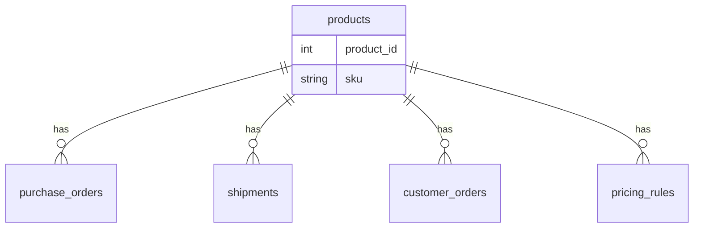

# Ripple

**Simulate SKU change impact before you touch production data.**

Ripple is an open-source agent for supply chain and operations teams. When you need to rename a product SKU, Ripple reads your real database, runs deterministic impact math in a sandbox, shows you what breaks, and **only applies safe changes after you click Allow**.

Built on [TrueForge](https://trueforge.dev) for the [Agent Harness Hackathon](https://www.wemakedevs.org/hackathons/trueforge).

---

## Table of contents

- [Who is this for?](#who-is-this-for)
- [The problem in 30 seconds](#the-problem-in-30-seconds)
- [How Ripple solves it](#how-ripple-solves-it)
- [Architecture](#architecture)
- [What you need installed](#what-you-need-installed)
- [Clone and run (step by step)](#clone-and-run-step-by-step)
- [Try it in the chat (2 prompts)](#try-it-in-the-chat-2-prompts)
- [What success looks like](#what-success-looks-like)
- [How the pieces fit together](#how-the-pieces-fit-together)
- [MCP tools reference](#mcp-tools-reference)
- [npm commands cheat sheet](#npm-commands-cheat-sheet)
- [Testing](#testing)
- [Troubleshooting](#troubleshooting)
- [Documentation map](#documentation-map)
- [License](#license)

---

## Who is this for?

- **Hackathon judges** — reproducible demo, CI, TrueForge harness features
- **Developers** — MCP + Postgres + sandbox pattern you can fork
- **Anyone new to agents** — clone, run three terminals, chat in TrueForge

No prior TrueForge experience required. If you can run Docker and `npm install`, you can run Ripple.

---

## The problem in 30 seconds

A **SKU** (stock keeping unit) is a product code in your catalog — like `ACME-1847`.

Renaming it sounds small. In reality, that code is linked to:



Change the SKU **without checking impact** and you can:

- Flag the wrong shipments  
- Miss revenue tied to open orders  
- Update the catalog but leave operations out of sync  

**Ripple answers:** “If I change SKU A → SKU B, what exactly is affected — and what is safe to auto-fix?”

---

## How Ripple solves it

Ripple follows four steps every time:



| Step | What happens | Why it matters |
|------|----------------|----------------|
| **1. Fetch** | MCP tools read live Postgres | Numbers come from **your data**, not the model’s imagination |
| **2. Simulate** | Python script computes impact | Revenue and counts are **deterministic code** |
| **3. Report** | Agent shows Impact Report | You see POs, orders, shipments, revenue at risk |
| **4. Approve** | You click **Allow** on `apply_product_update` | **No silent database writes** |

---

## Architecture



| Component | Folder | Role |
|-----------|--------|------|
| **TrueForge** | via `npx` | Agent UI, sandbox, approval gate, subagents |
| **MCP server** | `mcp-server/` | HTTP API the agent calls to read/write Postgres |
| **Simulation** | `simulation/` | Standalone Python impact calculator |
| **Database** | `db/` | Schema, seed data, Docker Compose |
| **Agent config** | `agent/` | Instructions + `ripple-simulation` skill files |
| **Scripts** | `scripts/` | Setup, demo reset, verification |

### TrueForge harness features Ripple uses

| Feature | What Ripple does with it |
|---------|---------------------------|
| **MCP tools** | Query products, orders, shipments, pricing; apply audited writes |
| **Sandbox** | Run `simulate_change.py` — math is code, not LLM guesses |
| **Approval gate** | `apply_product_update` blocked until you click **Allow** |
| **Skills** | `ripple-simulation` skill (from GitHub) guides sandbox usage |
| **Dynamic subagents** | Fetch and simulate can run in isolated subagent threads |

Details: [docs/design/PHASE4_SUBAGENTS.md](docs/design/PHASE4_SUBAGENTS.md)

---

## What you need installed

| Requirement | Version | Check |
|-------------|---------|--------|
| **Node.js** | 22.14+ | `node -v` |
| **npm** | 9+ | `npm -v` |
| **Docker Desktop** | running | `docker info` |
| **Python 3** | 3.x | `python3 --version` |
| **LLM API key** | Fireworks or Gemini | TrueForge → **Settings → Models** |

You do **not** need to clone the TrueForge repo. It runs via:

```bash
npx @truefoundry/trueforge@latest
```

(wrapped as `npm run trueforge` in this project)

Optional: copy [.env.example](.env.example) to `.env` if you want custom ports.

---

## Clone and run (step by step)

### 1. Get the code

```bash
git clone https://github.com/maannaan/Ripple.git
cd Ripple
npm install
```

### 2. Reset the demo database

This loads **Scenario A**: product SKU `ACME-1847` and related orders.

```bash
npm run demo:prep
```

### 3. Start TrueForge (Terminal 1)

```bash
npm run trueforge
```

Open **http://localhost:8790** in your browser.

**First time:** go to **Settings → Models** and add **Fireworks** or **Google Gemini** with your API key.

### 4. Start the MCP server (Terminal 2)

```bash
npm run mcp:dev
```

Health check: http://localhost:3100/health should return `ripple-mcp`.

### 5. Register MCP + agent (one time per TrueForge install)

With TrueForge and MCP both running:

```bash
npm run mcp:register
export RIPPLE_SKILL_GIT_URL=https://github.com/maannaan/Ripple
npm run skill:register
npm run agent:update
```

### 6. Verify everything (optional but recommended)

```bash
npm run rehearsal:verify
```

You should see `PASS` for simulation, MCP, database seed, and TrueForge.

---

## Try it in the chat (2 prompts)

1. In TrueForge go to **Agents → ripple** (not the default home chat).
2. Click **Clear chat** if you ran the demo before.

**Prompt 1 — impact analysis**

```
What is the impact of changing SKU ACME-1847 to ACME-2847?
```

Expand **Agent steps**. You should see MCP tool calls and sandbox `simulate_change.py`.

**Prompt 2 — approval**

```
Approve safe updates
```

TrueForge pauses on **`apply_product_update`**. Click **Allow**.

Full walkthrough: [docs/DEMO.md](docs/DEMO.md)  
Simple video script: [docs/VIDEO_SCRIPT.md](docs/VIDEO_SCRIPT.md)  
Animated launch video brief: [docs/VIDEO_PRODUCT_LAUNCH.md](docs/VIDEO_PRODUCT_LAUNCH.md)

---

## What success looks like

After Prompt 1 (before approval):

| Check | Expected value |
|-------|----------------|
| Revenue at risk | **21850** |
| Purchase orders | **101**, **102** |
| Customer orders (manual review) | **9001**, **9002** |
| In-transit shipment | **5002** |

After Prompt 2 + **Allow**:

| Check | Expected value |
|-------|----------------|
| Product SKU | **ACME-2847** |
| Shipment 5002 `needs_remapping` | **true** |
| Customer orders | unchanged (manual follow-up) |

Verify in terminal:

```bash
docker compose exec -T postgres psql -U ripple -d ripple -c \
  "SELECT sku FROM products WHERE product_id=1;
   SELECT shipment_id, needs_remapping FROM shipments WHERE product_id=1;"
```

Reset anytime:

```bash
npm run demo:prep
```

---

## How the pieces fit together

### Demo data (Scenario A)



- **Product 1:** `ACME-1847` → demo changes to `ACME-2847`
- **POs 101, 102** — open purchase lines
- **Orders 9001, 9002** — customer orders (manual review only)
- **Shipment 5002** — in transit (safe to flag for remapping)
- **Pricing** — East $850, West $890 → revenue math = **21850**

More scenarios: [simulation/README.md](simulation/README.md) (`scenario_b`, `scenario_c`)

### Simulation (no database)

The simulator only accepts JSON. It never connects to Postgres directly:

```
MCP fetch JSON  →  simulate_change.py  →  revenue_exposure, counts, safe_auto_updates
```

Run locally without TrueForge:

```bash
npm run simulation:run
npm run simulation:test
```

---

## MCP tools reference

| Tool | Read / write | Description |
|------|--------------|-------------|
| `get_product` | Read | Lookup product by SKU or `product_id` |
| `find_purchase_orders` | Read | POs for a product |
| `find_shipments` | Read | Shipments for a product |
| `find_customer_orders` | Read | Customer orders for a product |
| `find_pricing_rules` | Read | Regional pricing for a product |
| `apply_product_update` | **Write** | Update SKU + flag in-transit shipments (needs **Allow**) |
| `get_audit_log` | Read | Audit trail after apply |

MCP details: [mcp-server/README.md](mcp-server/README.md)

---

## npm commands cheat sheet

### First-time setup

| Command | What it does |
|---------|----------------|
| `npm run demo:prep` | Reset DB to Scenario A (`ACME-1847`) |
| `npm run trueforge` | Start TrueForge UI on :8790 |
| `npm run mcp:dev` | Start MCP server on :3100 |
| `npm run mcp:register` | Connect MCP to TrueForge |
| `npm run skill:register` | Register simulation skill (needs `RIPPLE_SKILL_GIT_URL`) |
| `npm run agent:update` | Push latest agent config to TrueForge |

### Day-to-day

| Command | What it does |
|---------|----------------|
| `npm run rehearsal:verify` | Pre-flight: sim + MCP + DB + TrueForge |
| `npm run demo:prep` | Reset demo after a test run |
| `npm run ci` | Build MCP + run simulation tests |
| `npm run e2e:pipeline` | Automated logic test (no UI) |
| `npm run fix:sandbox-git` | Diagnose git/skill sandbox issues on macOS |

Full testing guide: [docs/TESTING.md](docs/TESTING.md)

---

## Testing

```bash
npm run ci                  # fast: build + simulation A/B/C
npm run e2e:pipeline        # full logic path with Docker
npm run rehearsal:verify    # needs TrueForge + MCP running
npm run verify:phase4       # subagent manifest checks
```

Benchmarks: [docs/BENCHMARKS.md](docs/BENCHMARKS.md)

---

## Troubleshooting

| Symptom | Likely cause | Fix |
|---------|--------------|-----|
| Agent asks clarifying questions, **0 tool calls** | Wrong chat session | Use **Agents → ripple**, not default chat |
| Model shows `kimi-*` not `fireworks/minimax-m3` | Wrong agent selected | Open **ripple** agent specifically |
| `rehearsal:verify` fails on SKU | DB already mutated | `npm run demo:prep` |
| Sandbox: `git ls-remote failed` | macOS git / xcode-select in sandbox | Agent uses curl fallback; or `npm run fix:sandbox-git` |
| MCP errors | MCP not running | `npm run mcp:dev` |
| Wrong revenue (not 21850) | Simulation skipped | `npm run skill:register` + `npm run agent:update` |
| Docker errors | Docker not started | Start Docker Desktop, then `npm run demo:prep` |
| Gemini credit errors | Billing | Use Fireworks: default model is `fireworks/minimax-m3` |

---

## Documentation map

| Doc | Best for |
|-----|----------|
| [docs/DEMO.md](docs/DEMO.md) | Judge demo script |
| [docs/VIDEO_SCRIPT.md](docs/VIDEO_SCRIPT.md) | Live demo narration (simple English) |
| [docs/VIDEO_PRODUCT_LAUNCH.md](docs/VIDEO_PRODUCT_LAUNCH.md) | YC-style animated explainer + Remotion prompt |
| [docs/TESTING.md](docs/TESTING.md) | All test layers explained |
| [docs/BENCHMARKS.md](docs/BENCHMARKS.md) | Simulation performance |
| [docs/PORTAL_SUBMIT.md](docs/PORTAL_SUBMIT.md) | Hackathon submission |
| [agent/README.md](agent/README.md) | Agent + skill setup |
| [simulation/README.md](simulation/README.md) | Fixtures and golden numbers |
| [docs/design/](docs/design/README.md) | Design notes |

---

## Hackathon

- **Repository:** https://github.com/maannaan/Ripple  
- **CI:** [GitHub Actions](https://github.com/maannaan/Ripple/actions)  
- **Qodo review:** [PR #2](https://github.com/maannaan/Ripple/pull/2) (merged)  
- **Submit:** [WeMakeDevs TrueForge portal](https://www.wemakedevs.org/hackathons/trueforge)

---

## License

MIT — see [LICENSE](LICENSE).

Legacy Anthropic setup: [docs/LEGACY.md](docs/LEGACY.md)
