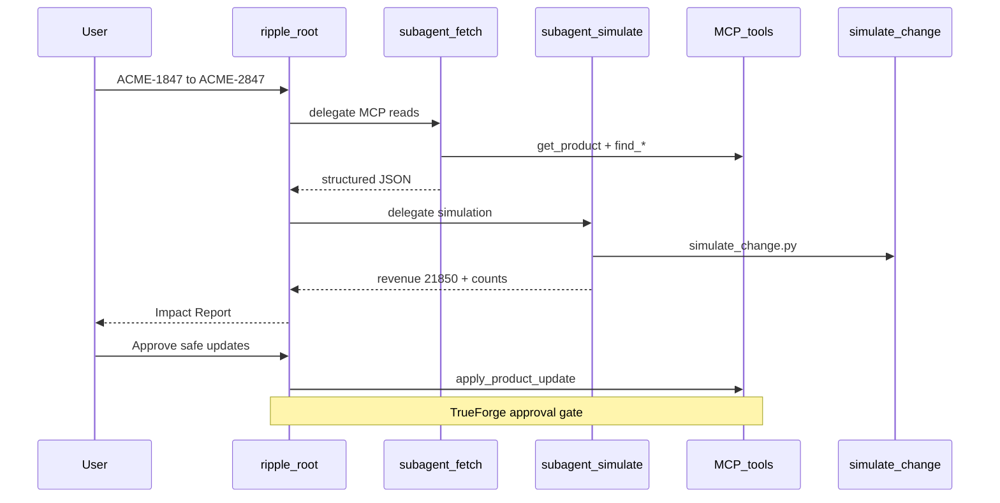

# Phase 4: Subagent orchestration

Ripple Phase 4 enables **TrueForge dynamic subagents** on the `ripple` agent. The harness spawns focused subagents at runtime; each gets isolated context and returns only its result to the root agent.

## Architecture



| Role | Responsibility | Writes DB? |
|------|----------------|------------|
| **Fetch subtask** | `get_product` + all `find_*` MCP calls | No |
| **Simulate subtask** | Sandbox `simulate_change.py` | No |
| **Root agent** | Impact Report, approval gate, `apply_product_update` | Yes (gated) |

## Manifest (Phase 4)

Configured in [`scripts/lib/agent-manifest.sh`](../../scripts/lib/agent-manifest.sh):

```json
"config": {
  "sandbox": { "enabled": true, "file_downloads": true },
  "dynamic_sub_agents": { "enabled": true }
}
```

Apply to TrueForge:

```bash
npm run agent:update
npm run verify:phase4
```

## Instruction files

| File | Purpose |
|------|---------|
| [`agent/instructions.md`](../../agent/instructions.md) | **Shipped** — orchestration + demo workflow |
| [`agent/instructions-orchestrator.md`](../../agent/instructions-orchestrator.md) | Reference — root coordinator role |
| [`agent/instructions-analyst.md`](../../agent/instructions-analyst.md) | Reference — fetch + simulate role |

## Completion checklist

- [x] `dynamic_sub_agents.enabled: true` in agent manifest (`agent-manifest.sh`)
- [x] Orchestration instructions in `instructions.md` (fetch → simulate delegation)
- [x] `npm run verify:phase4` verification script
- [x] Demo agent `ripple` upgraded (not a separate orchestrator agent)
- [ ] Manual: Scenario A chat shows subagent threads in TrueForge UI (optional video beat)

## Testing

- **Static / manifest:** `npm run verify:phase4`
- **Logic path (no UI):** `npm run e2e:pipeline` — see [docs/TESTING.md](../TESTING.md)
- **Harness proof:** [docs/DEMO.md](../DEMO.md) manual chat + approval gate

## References

- Agent setup: [`scripts/create-ripple-agent.sh`](../../scripts/create-ripple-agent.sh), [`scripts/update-ripple-agent.sh`](../../scripts/update-ripple-agent.sh)
- TrueForge harness: [dynamic subagents](https://trueforge.dev/create-agent/overview)
